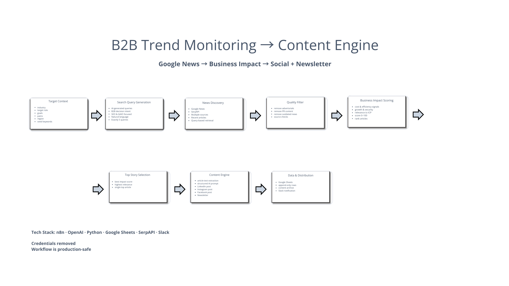

# n8n Workflow: B2B Trend Monitoring & Content Engine

Dieses Repository versioniert einen **n8n-Workflow** zur automatisierten Erkennung relevanter
B2B-Trends, Bewertung nach Business-Impact und KI-gestützten Erstellung von Social-Posts
und Newsletter-Inhalten für Entscheider im Mittelstand.

---

## Workflow Architektur

---

## Inhalt

- `n8n/workflows/` – exportierter n8n-Workflow (JSON)
- `docs/` – Architekturdiagramme und Screenshots
- `README.md` – Projektdokumentation

---

## Workflow: B2B Trend Monitoring & Content Engine

### Zweck

- Lädt Zielgruppen- und Branchenkontext aus Google Sheets
- Generiert **entscheidungsnahe Suchanfragen** (SEO & GAIO)
- Ruft aktuelle B2B-News über Google News (SerpAPI) ab
- Filtert irrelevante Inhalte (Advertorials, PR, veraltete Artikel)
- Bewertet Artikel nach **Business Impact**
- Wählt automatisch die relevanteste Top-Story
- Erstellt KI-gestützt:
  - LinkedIn Post
  - Instagram Post
  - Facebook Post
  - Newsletter
  - News-Zusammenfassung
  - Headline
- Speichert alle Ergebnisse strukturiert in Google Sheets
- Sendet Statusmeldungen an Slack

---

## Input

### Google Sheets – Zielgruppen- & Kontextdaten

Erwartete Spalten:

- `Branche`
- `Zielgruppenrolle`
- `Alter`
- `Ziele der Zielgruppe`
- `Ängste der Zielgruppe`
- `Land/Region der Zielgruppe`
- `Keywords für die Zielgruppe`

Jede Zeile repräsentiert **eine Zielgruppe** und wird vollständig automatisiert verarbeitet.

---

## Verarbeitung

1. **Schedule Trigger**
   - Wöchentliche Ausführung

2. **Query-Generierung (OpenAI)**
   - Exakt 5 Suchanfragen
   - B2B-orientiert
   - Entscheidungs- und kaufnah
   - SEO- und GAIO-tauglich

3. **News-Abruf (Google News via SerpAPI)**
   - Mehrere Artikel pro Query

4. **Qualitätsfilter & Business-Impact-Scoring**
   - Ausschluss von:
     - Advertorials / Sponsored Content
     - PR-Verteilern
     - Veralteten Artikeln
   - Score von 0–100

5. **Top-Story-Auswahl**
   - Auswahl des relevantesten Artikels

6. **Artikeltext-Extraktion**
   - HTML → Klartext
   - Fallback bei zu wenig Text

7. **Content-Erstellung (OpenAI Agent)**
   - Einheitliche Struktur:
     - Hook
     - Insight
     - Meinung
     - Call-to-Action
   - Keine Hashtags
   - Keine Emojis
   - Keine externen Annahmen

8. **Persistierung & Benachrichtigung**
   - Append in Google Sheets
   - Slack-Notification bei Erfolg oder Fehler

---

## Output

### Google Sheets – Content-Daten

Pro Artikel wird **eine Zeile** geschrieben mit folgenden Spalten:

- Titel
- News
- Headline
- URL
- Post LinkedIN
- Post Instagram
- Post Facebook
- Newsletter

---

## Import in n8n

1. n8n öffnen
2. Workflows → Import from File
3. JSON aus `n8n/workflows/` auswählen
4. Credentials neu verbinden
5. Google Sheet konfigurieren
6. Workflow aktivieren

---

## Abhängigkeiten

Dieses Repository benötigt **keine `requirements.txt`**.

Die gesamte Ausführung erfolgt innerhalb von n8n mit den integrierten Runtimes.
Externe Abhängigkeiten (Python, Node usw.) werden vollständig von n8n selbst verwaltet.

---

## Wichtige Hinweise (Sicherheit)

- **Keine Secrets im Repository**
- Keine API-Keys oder Tokens im JSON
- Credentials ausschließlich in n8n verwalten:
  - Settings → Credentials
- Platzhalter im Workflow:
  - `GOOGLE_SHEET_ID`
  - `GOOGLE_SHEET_GID_OR_NAME`
  - `SLACK_CHANNEL_ID`

---

## Empfohlene Repo-Konventionen

- Branches:
  - `feature/...`
  - `fix/...`
  - `chore/...`

- Commits:
  - `feat: ...`
  - `fix: ...`
  - `chore: ...`
  - `docs: ...`

---

## Lizenz

Dieses Projekt ist unter der MIT-Lizenz lizenziert.  
Weitere Informationen findest du in der Datei [LICENSE](LICENSE).
